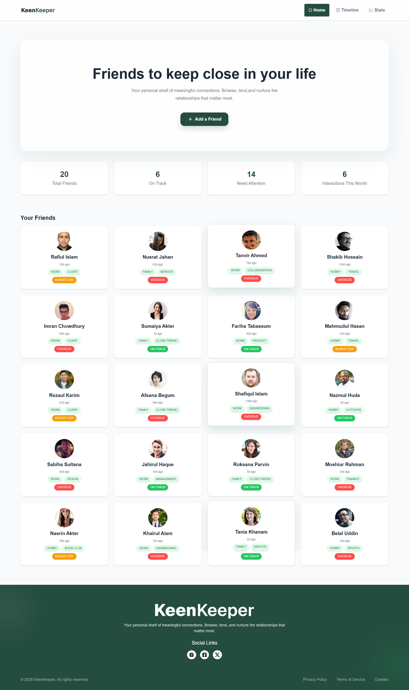
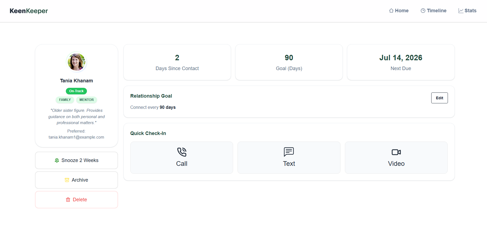

-------------------------------------------
# KeenKeeper

KeenKeeper is a React-based friendship management web app designed to help users track friends, log interactions, and analyze communication patterns in a clean and intuitive interface.


---

## 🔗 Live Demo
 - 🌐[](https://keen-keeper-oa1r.vercel.app/)
- 💻 Repository: [Repo Link](https://github.com/RS-Arafath/KeenKeeper.git)

---

## 📸 Preview



---

## ✨ Features

- View all friends from structured JSON data
- Detailed friend profile view with metadata
- Track time since last interaction
- Log interactions (Call / Text / Video)
- Persistent timeline using `localStorage`
- Auto-cleanup of outdated interactions (24h rule)
- Smart search across timeline entries
- Filter interactions by type
- Visual analytics using charts
- Fully responsive UI across devices

---

## 📄 Pages Overview

### 🏠 Home
- Displays all friends in card layout
- Shows summary insights (total friends, activity overview)

### 👤 Friend Details
- Profile information with tags and details
- Quick action buttons for interactions

### 🕒 Timeline
- Interaction history log
- Search and filter support

### 📊 Stats
- Visual representation of user interaction data

---

## 🧰 Tech Stack

- React
- React Router
- Tailwind CSS
- DaisyUI
- Recharts
- React Icons
- React Toastify
- JavaScript (ES6+)
- LocalStorage API
- JSON Data Handling

---

## ⚙️ How It Works

1. Friend data is loaded from `public/FriendsData.json`
2. Home page renders all friend cards
3. Selecting a friend navigates to details page
4. Users log interactions (Call / Text / Video)
5. Interaction data is stored in Context + LocalStorage
6. Stats page dynamically updates based on timeline data
7. System automatically removes data older than 24 hours

---

## 1. Clone the repository
### Installation

**Clone the project:**

Go to the project folder:

Install dependencies:

```bash
npm install
```

Run the project:

```bash
npm run dev
```

Build the project:

```bash
npm run build
```

Run lint:

```bash
npm run lint
```
---
## Project Structure

```bash
KeenKeeper

├── public/
│   └── FriendsData.json
├── src/
│   ├── assets/
│   ├── Components/
│   ├── Context/
│   ├── Layout/
│   ├── Pages/
│   ├── Routes/
│   ├── utils/
│   ├── main.jsx
│   └── index.css
├── package.json
├── vite.config.js
└── README.md
```
---


### Friend Details Page


### Timeline Page


### Stats Page


---
## 🚀 Future Improvements
- CRUD operations for friends
- Backend integration (database)
- Authentication system
- Dark mode support
- Enhanced analytics dashboard
- Notification system
---
# 👨‍💻 Author
**RS Arafath**
* GitHub: [Connect by Github](https://github.com/RS-Arafath)
* LinkedIn: [Connect in Linkdin](https://www.linkedin.com/in/rs-arafath/)
* Email: *contact.arafath.bd@gmail.com*
---
## ⭐ Show Your Support
**If you like this project, consider giving it a ⭐ on GitHub.**
**If you want, next step I can turn this into:**
- 🔥 Portfolio-ready README (recruiter focused)
- or add badges + GitHub stats + profile banner style README